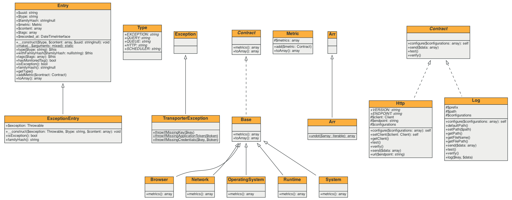

<p align="center">
<a href="https://github.com/Crypt4/jantung-php/actions"></a>
</p>

# Jantung PHP Client

Jantung is a simple issue tracker for monitoring your application crashes. This package developed for PHP.

## Installation

```bash
composer require Crypt4/jantung-php
```

## Adding New Metric

You can add a new metric as you see fit to your application / framework.

Do take note, all metrics will be converted to associative array.

In order to create your own metrics, you need to extends the class `Crypt4\Jantung\Metric\Base` and implement your metrics details in `metrics()` method which always return an array. You may need to define as a dot notation in your metric.

However, Jantung will convert to the associative array.

Following is an example for capture Http request for Laravel framework.

```php
<?php

namespace App\Metric;

use Crypt4\Jantung\Support\Arr;
use Crypt4\Jantung\Metric\Base;
use Illuminate\Support\Str;

class Http extends Base
{
    public function metrics(): array
    {
        $startTime = defined('LARAVEL_START') ? LARAVEL_START : request()->server('REQUEST_TIME_FLOAT');

        return [
            'http.client.duration' => $startTime ? floor((microtime(true) - $startTime) * 1000) : null,
            'http.scheme' => request()->getScheme(),
            'http.route' => request()->getRequestUri(),
            'http.method' => request()->getMethod(),
            'http.status_code' => http_response_code(),
            'http.query' => request()->getQueryString(),
            'http.uri' => str_replace(request()->root(), '', request()->fullUrl()) ?: '/',
            'http.headers' => Arr::undot(collect(request()->headers->all())
                ->map(function ($header) {
                    return $header[0];
                })
                ->reject(function ($header, $key) {
                    return in_array($key, [
                        'authorization', config('jantung.header-key'), 'jantung-key',
                    ]);
                })
                ->toArray()),
        ];
    }
}
```

Once you have declared your metric, you can use in your application:

```php
use App\Metrics\Http;
use Crypt4\Jantung\Metric\Metric;

$metric = new Metric();

$metric->add(new Http());

$metric->toArray();
```

If you are adding from Laravel framework, you can simply just add in `config/jantung.php`:

```php
'metrics' => [
    \App\Metrics\Http::class,
];
```

## Class Diagram

<center>

</center>
